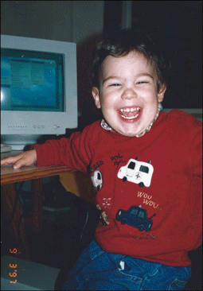

## Here's a small Alexandre - and very happy to meet you! 👋

I still feel deeply in awe with the sheer magnitude of *what's possible with programming*. My academic background is in (pure) Math, and that always felt a little *off* (too much theory; very little hands-on creativity?). But as the global pandemic rolled in, requiring mandatory lockdowns everywhere, I took the opportunity to pursue what was already a [mild flirtation with Python](https://exercism.org/profiles/intrigado); the subsequent months netted me [a really cool exercise in building a website from the bottom up using Flask](https://bzzzzzzz.buzz), and a very close call at getting hired in a trainee position in one of Portugal's unicorns. 🦄

By October that year, I was enrolling in the first-ever [*piscine* at **42Lisboa**](https://www.42lisboa.com/en/), and started the cursus in February, 2021 - having also based myself in sunny Lisbon. 🌇 The school's curriculum is challenging (mostly C and C++ in the early stages, before a mandatory internship at a company) and lays a solid foundation for any modern well-rounded developer. 

And then there are the many areas of interest which I'll try to foster, by both practice and writing, in this new platform. It is mostly an exercise for me - but hopefully someone can get something out of this too. Welcome, and thank you for being here! 🙌

 
