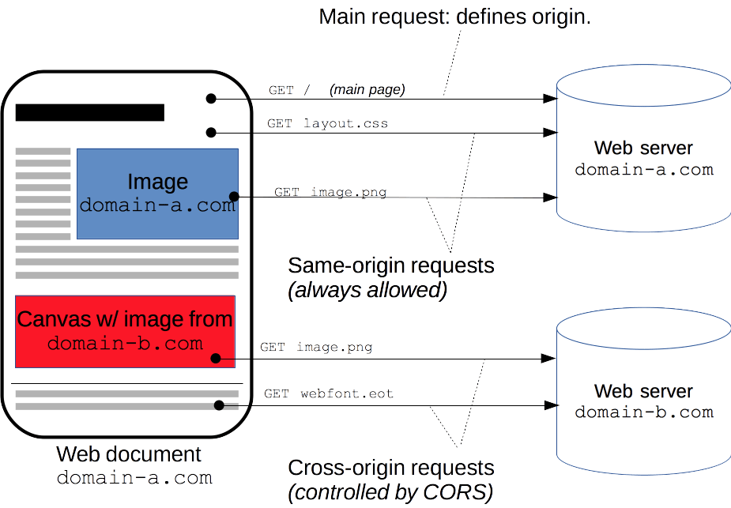

# {{ $page.title }}

Yesterday was a somewhat productive day - if not necessarily with big advancements on the project, it surely helped to have a big overview of the (admittedly small) codebase. There was a very naive problem, for example: if one did a GET request for a given day and there were none to retrieve, the API would return a small written message (`no comments!`), along with a status code. This seems fine, but I used a 204. According to the Mozilla documentation, 

``
The HTTP 204 No Content success status response code indicates that a request has succeeded, but that the client doesn't need to navigate away from its current page. This might be used, for example, when implementing "save and continue editing" functionality for a wiki site.
``

So the requests were being made - and with a positive response (a status code in the 200's) - but the browser did not show any particular message; this was a very naive problem to have, and highlights how much care there should be with using proper status codes.

## Current state of affairs 💒

As it is, the back-end server is waiting for both GET and POST requests; the front-end, however, cannot properly pull any of these requests. Here's a log for a POST request, and very similar to a GET one too.

::: danger Error log
``Cross-Origin Request Blocked: The Same Origin Policy disallows reading the remote resource at https://bzzzzzzz.buzz/api/post_comment. (Reason: CORS header ‘Access-Control-Allow-Origin’ missing). Status code: 200. ``
:::

Now, let me be very forward: *I have no idea what I'm doing*. To the best of my knowledge this was already handled, on a previous day - but it seems like I didn't properly document that adventure. At this point, the GET request works when visiting the URL directly (`https://bzzzzzzz.buzz/api/get_comments?day=37`), but not when doing the request from the Alex Makes Codes website (AMC); suppose the same happens with a POST request.

I'm at a loss, having spent a couple of hours looking into various solutions; I'll try to document my understanding of this whole mess.

### What is CORS, really?

Let's start with the basics. CORS stands for Cross-Origin Resource Sharing, and it is `an HTTP-header based mechanism that allows a server to indicate any origins (domain, scheme, or port) other than its own from which a browser should permit loading resources` ([thanks, Mozilla](https://developer.mozilla.org/en-US/docs/Web/HTTP/CORS)). This is a tricky definition because there's various actors at play: the **browser**, a **server** and **origins**.

In this situation, my **origin** is `https://alexmakes.codes/``, where there is a Javascript process (on the **browser**) making a request to the `https://bzzzzzzz.buzz/api/` **server**. It would not be a cross-origin request if I had hosted the api at ``https://api.alexmakes.codes/`` (in fact, that would probably be the best solution, but my hosting platform doesn't quite accomodate that option - maybe I can fix that in the future, by self-hosting).

The Javascript request is triggering CORS, but it is, in a way, a *simple* request (thus not requiring a *preflight* request, which is another layer of trouble - I think I'm avoiding those for now, and I do now recall, a couple weeks back, [having to massage the JS requests to be simple](https://developer.mozilla.org/en-US/docs/Web/HTTP/CORS#simple_requests)).

### The current issue.

At this point, I realise there are two different problems.

I believe the Django back-end is properly configured. I followed the instructions for CORS-compliance [using some reputable middleware](https://pypi.org/project/django-cors-headers/). To confirm this, I expect a local instance of the server to provide the appropriate response headers - but this is not happening. So I suppose it is probably not well implemented.

On the other hand, the deployment architecture is slightly different than just running a server barebones on a host. It is being reverse-proxied by Nginx, which implies some redirection of requests, and this has probably something to do with CORS too.

So...I have to look into those two issues.

<FetchComments :title=$frontmatter.title />
<PostComments :title=$frontmatter.title />
