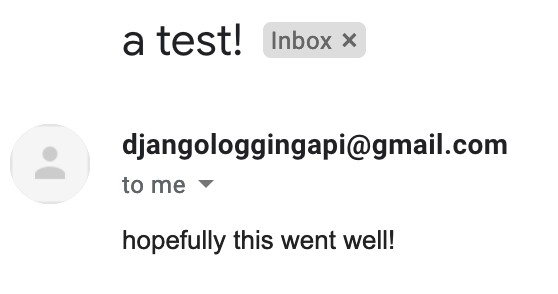

# {{ $page.title }}

It's really great to have direct feedback on the posts! Michele (referencing our great collaborative effort of the Minishell under the guise *Mishell*) wanted some more Docker `volumes` content, and I gave it a go...and I didn't make much meaningful progress. But emails, on the other hand...

## ...they work quite nicely!

Django really is a batteries-included framework. I followed the [neat example](https://docs.djangoproject.com/en/4.0/topics/email/) on the official documentation and received the e-mail straight away (although I had to allow for unsecure application in the gmail account 🤷‍♂️).

To have it send an email at every posted comment, one does only need to hijack the POST view; I created a small function that builds the email body taking the comment's information, and it works very nicely.

<FetchComments :title=$frontmatter.title />
<PostComments :title=$frontmatter.title />
