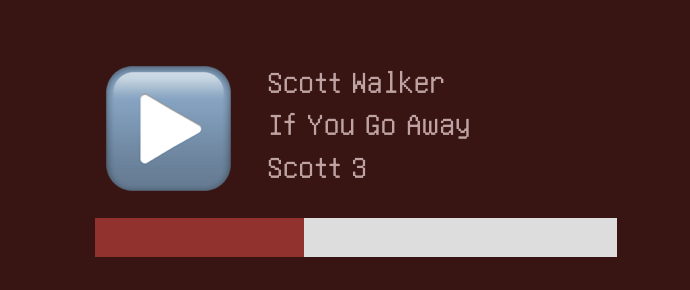

# {{ $page.title }}

**The task:** display current song information on the website;
**The process:** connect to the `mpd` instance of the Raspnberry;
**The trouble:** oh, so many.

## What I tried so far...

Many things. Dockerisation of the `mpd` instance is a mess (handling configs, volumes, etc.), and will come later; after many experiments, it's just not worth it for now. I'll keep it running on the bare Raspberry, and figure something out.

Having made peace with that solution, I mused having the API run on the bare Raspberry, without being containerised —  but it needs Certbot approval (otherwise the certified website would incur in a mixed content issue), and the certification is being handled with the dockerised nginx. Could it be made so that [nginx routes to the main machine, outside of the containers](https://stackoverflow.com/questions/31324981/how-to-access-host-port-from-docker-container/61424570#61424570)? 

Well...apparently, [this works!](https://stackoverflow.com/a/48547074). nginx is pointing to `172.17.0.1` on the API's port, and it is now serving the current song information over HTTPS, avoiding mixed content. Programming is such a weird endeavour! 

## Onto Javascript and CSS! 🧚

After doing many consecutive hours of Docker administration, *real code* seems like a blessing: one can effortlessly log output, and iterate over the code very, very quickly. In fact, this **is already up and running!** 🥳

The biggest issue was realising one cannot parse a JSON response right away:

```js
let json_response = JSON.parse(this.response);
```

The script runs at page-load and then every 10 seconds; but this introduces a few problems. Supposing a song change every 3 minutes, that yields 17 redundant requests. This can be mitigated in various ways, but I will leave it as it is, for now...and reap the peace of mind of *having finally made this happen! 😌*

The website in general needs some QoL updates: with every page load, the radio elements will appear a handful of miliseconds after the other content. I'd like to make this more homogenous...but not now!



<FetchComments :title=$frontmatter.title />
