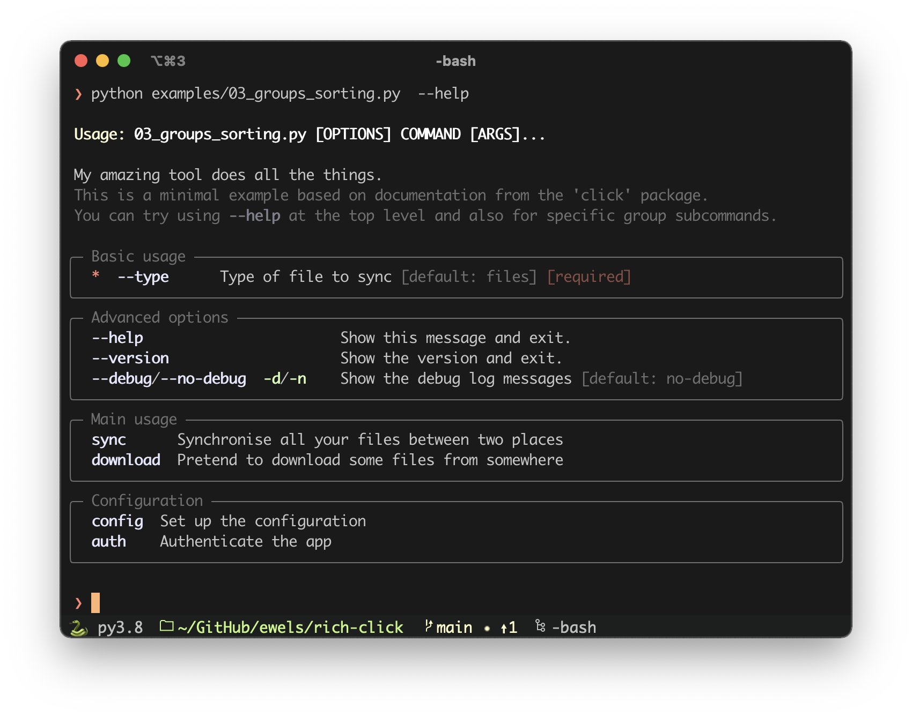

# {{ $page.title }}

*the following was written on* lardafada, *at 14:53:10*.

Three days have gone by and the decimal day trend keeps on; not necessarily due to a lack of proper programming work, but, as I suspected, there's a pesky bug with the comments API whenever days are not integers. This is something that I definitely brought upon myself *just to make my life a little harder*, and I'll come about to solve it...eventually. It most likely involves some Django database migrations, so it should be interesting to see how that goes.

On some other news, I've been spending some quality time with this new computer of mine, and it has been a great companion for some out-of-the-regular-office work. It has been in parks 🌲 and also in some Lisbon balconies, catching plenty of sun and overlooking the river 🌻 it does precisely what I need it to do, and it has been a great addition to my tech inventory. There are still some odd issues here and there: I haven't yet spent proper time understanding the clipboard, and C programming is not too reliable — the compiler had some issues finding some files and libraries, which work great on the Mac, and now compilation fails altogether, with the following error message:

```
gcc -Wall -Wextra -Werror -g -lpthread -I includes -L. -l ft -D BONUS=0 srcs/init.c srcs/threads.c srcs/join.c srcs/misc.c srcs/actions.c  srcs/philo.c -o philo
/usr/bin/ld: /usr/lib/gcc/x86_64-pc-linux-gnu/11.1.0/../../../../lib/Scrt1.o: in function `_start':
(.text+0x24): undefined reference to `main'
collect2: error: ld returned 1 exit status
make: *** [Makefile:22: philo] Error 1
```

I find that relative path to be somewhat scary, and I'm putting this problem aside for the time being 😬

## New projects! Because Alexandre hasn't got *enough* on his plate for now!

Yesterday I set myself to fix a pesky Javascript bug on the `bzzzzzzz` website — for some reason, setting blank `src` attributes on `audio` elements can be troublesome — and have now no clear direction on where to go next. Of course, it would be great to have a proper front-end interface, or at least some back-end automation that could change the radio to whatever, but I do feel a great bottleneck at getting new content in the server. It should not be a big secret that most of it comes from torrenting (all very legal files, mr. Officer! 👮), and I want to be able to get the `.torrent` files without having to hop on a browser, and manually search for wherever they are.

Some months ago, I collaborated with [Daedalus1337](https://github.com/daedalus1337/red) on a command-line interface (CLI) that could precisely do something of this sort, but it is still somewhat limited: searching for and downloading a torrent are still two very separate actions, and I'd like to have a better interface with it to fit to my needs. So here's a try at organising thoughts and priorities, hoping for a more relaxed development experience.

### it must be efficient at searching and downloading 🔎

the script can search, and can download, but I'd like to do both on a single query alone. The current workflow is 
1. search for an `artist` and/or `release`;
-   if just the `artist` is used, many `release` are retrieved; if `release` is used, many `ids` are retrieved.
2. on another query, use the `id` to download the proper torrent file;

It works, *but I feel it could be better*; it feels more natural to query an artist and follow up with a torrent download *on the same query* — something like inputting a sequence of commands to select a torrent, get possible download formats, and follow up on it. This leads to the next point...

### the interface must be good, with easily browsable output 🗞️

the current script will output a very long list of results, which should then be scrollable by nifty keyboard shortcuts or — *gasp* — the mouse. I don't have any immediate idea on how to solve this particular design quip, but have, on the other hand, a nudge that might put me on the right track...

### I'd like to work with [Rich](https://github.com/Textualize/rich), a Python library for interfaces 🖌️

I've been tracking this very recent library for a while now, and there have been some very impressive results with it. It seems to bring me closer to having a graphical interface living on the terminal, and it looks like something very fun to develop with.



<FetchComments :title=$frontmatter.title />
<PostComments :title=$frontmatter.title />

