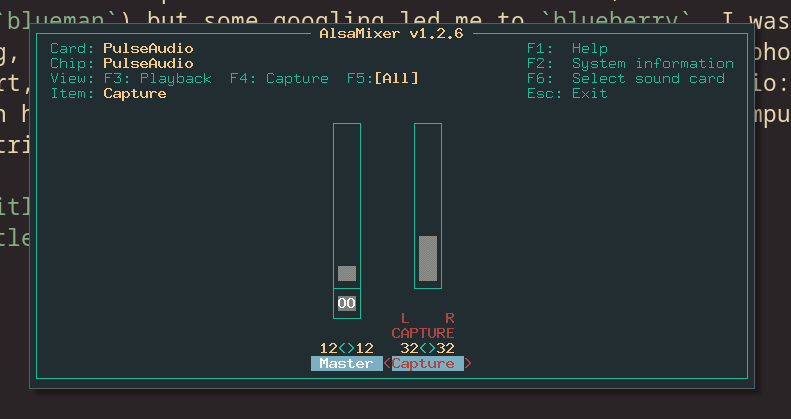

# {{ $page.title }}

*the following was written on* lardafada, *at 12:16:03*.

Alright, alright, alright. So there are a few nice things to mention.

### Remember those Bluetooth issues?

A couple days back, I wrote about the Bluetooth problems on `lardafada`. In fact, there were some issues connecting with a Bluetooth utility that was already installed (`blueman`) but some googling led me to `blueberry`. I wasn't able to connect to one device, but a couple days later (yesterday evening, in fact, as I know you were all wondering!) my headphones managed to connect. So far, so good,as there are no pesky issues to report, except for a small inconsistency in the system audio: the keyboard keys control audio, but it doesn't interfere with the Bluetooth headphones (they only work in cable headphones or computer speakers); on the other hand, the volume buttons on the headphones will trigger *another* audio interface. 

I guess I'll figure this out, eventually. For now, I rejoice in having functional bluetooth headphones!

### I now have a proper screenshotting tool! 🖼️

This had been a long time coming, and in fact there was no special reason for this to have taken so long in the making. I just installed `flameshot` and it works pretty well, very much akin to the default Mac OS screenshotting tool. So expect more pictures of `lardafada` soon!

### Lots of small fixes on my websites!

The comments API fix was really easy; just a matter of changing the field type in the back-end (it is now a Float, and it could have been a positive float just as easily). As for the `bzzz` issue with failing broadcasts, my current solution is to check for broadcast status at every ten seconds. It's not optimal, but it could be way worse. In case of failure, it just sends a `play` command, which is good enough of a solution when the broadcast just stops because of some momentarily connection failure (as for the cause of the failure, I still have no clue). 

This small script was done in Python. At the moment, there are maybe three Docker containers running on the Raspberry, plus two standalone Python scripts that are not even running as cronjobs or services. This is quite a frail setup, but we'll get there eventually. Baby steps!

There was also one small improvement to be made with the song display API, which powers the song information on the website. It currently queries the back-end every ten seconds — which is quite absurd, as songs usually run for around 3 minutes. Thus, I changed the back-end accordingly, to provide the number of seconds until the song finishes. This way, the browser knows how long to wait until the next request.

These changes are now live in the API, but the Javascript code is not yet fully functional. I tried to hack a quick solution yesterday evening, but wasn't able to have it working properly; turns out, a `sleep` instruction in Javascript is not as simple as Python's, and there are usually Promises involved. I'll give it a proper look today!

## Quite a productive day, Alexandre! 🤯 

It might feel so, but it is in fact not quite. I quite enjoy working in the morning, but, on the other hand, it felt really nice to be away from the computer the whole morning, when I tried it out a couple of days ago. As with everything in life, this is probably a matter of finding the most appropriate balance in life.

I'd like to reduce on pointless internet wandering, and shove away the lingering feeling of *having to be productive* at all times. There are smarter people than me (oh, so many!) that will produce *much better, and more interesting* code in the long run. I'd just like to have a chance at doing some of it myself too, you know?

*the following was written on* lardafada, *at 18:17:30*.

### SSH is now properly working!

Well, what a good day for my productivity! Tired of wasting *so much time* typing my very-long passphrase over and over again (I would love to tell you all my passphrase: it really is quite long, as it consists on a gramatically sound, very meaningful Portuguese sentence), I once again ran into the internet for help. Something was not quite working with the `ssh-agent`, and so I turned into a radically different solution: to use [Keychain](https://www.funtoo.org/Funtoo:Keychain), which works quite nicely!

I got the initiation script onto my `.zshrc`, and appended a `--quiet` flag for it not to happily announce **how my passphrase is properly stored every time I launhc a new terminal window**. So, as of now...many of my issues are taken care of! Such a relief. It also unlocks tab-autocompletion when doing `scp` commands, which is something I do quite often to get the content out of the Raspberry. Oh, such good news!

<FetchComments :title=$frontmatter.title />
<PostComments :title=$frontmatter.title />
