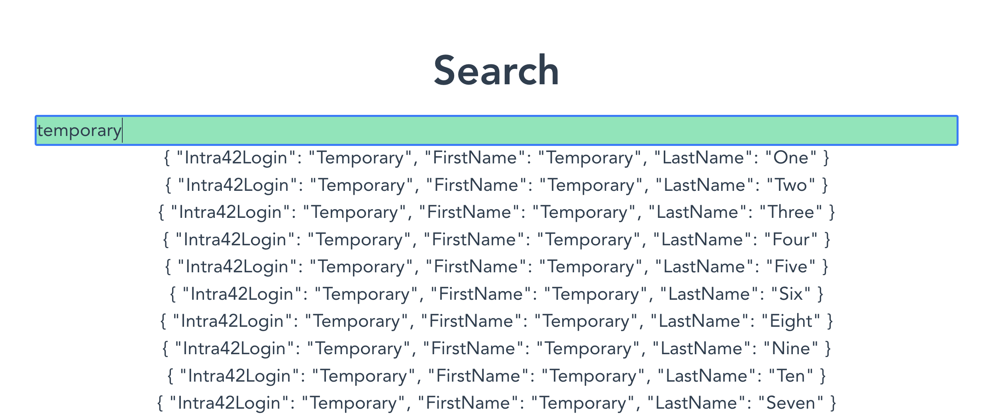

# {{ $page.title }}

*the following was written on* bocals-iMac, *at 12:02:06*.

I'm aware of my not being diligent enough to update this *every day*; it's just a matter of building up the routine once again, I suppose. Yesterday I spent most of my working day trying to get a Vue component to work properly — for reference, it needed to fetch the content of an API, and feed its response to a Fuse engine (fuzzy finder). It took a while, with errors that I swear were absolutely ungoogleable. All is good now, fortunately.

## What's ahead, now?

Now, the point of this particular view is searching for a user **and then access the user page**. So, with having the fuzzy finder in place, one now needs to properly navigate the results of the search.

Yesterday I saw some Vue videos, and it was a great reminder of how many interactions can be setup from the front-end. At this point, I'm thinking of rendering these results as individual `div` elements, and then implement keyboard navigation on the items. 

<FetchComments :title=$frontmatter.title />
<PostComments :title=$frontmatter.title />
