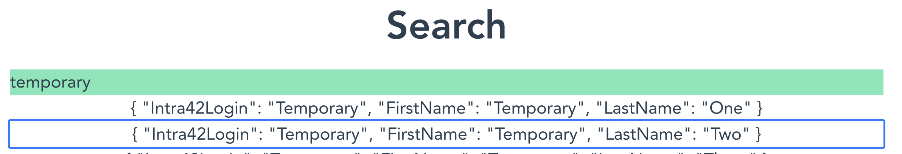
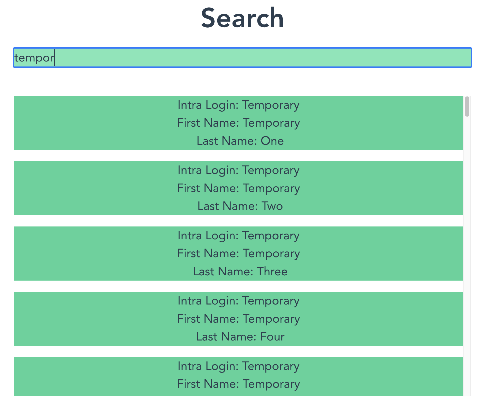

# {{ $page.title }}

*the following was written on* bocals-iMac, *at 10:22:23*.

Err...I don't quite remember what happened yesterday, but there was not much progress on this particular issue. Thus today I want a better set plan on how to proceed further, and then, hopefully, I'll act upon that plan. Plans are good.

## Learning about spatial navigation!

As soon as one looks up *spatial navigation Vue* on the web, there seem to be two possible courses of action: there's a [Vue implementation](https://github.com/twcapps/vue-spatialnavigation) (which seems to be 2.X only, and I'm running Vue 3), as well as a page by [CSSWG](https://drafts.csswg.org/css-nav-1/) (CSS Working Group), and the latter looks like a much more serious endeavour. The page is properly documented, which many examples and definitions, and as a rule of thumb I'll stick with bare CSS rather than Vue/Node implementations of stuff (because Javascript can be very messy for someone who doesn't speak the language).

However, the CSSWG introduction is quite clear: "*Spatial navigation can be useful for a web page built using a grid-like layout, or other predominantly non linear layouts*". Well...so far, I'm presenting the search results in a very linear layout (it's vertical!), so maybe *spatial* is overkill. Just below, there's an example of a few HTML elements

```html
<div id="scroller">
    <div class="box" tabindex="0">Box 1</div>
    <div class="box" tabindex="0">Box 2</div>
    <div class="box" tabindex="0">Box 3</div>
    <div class="box" tabindex="0">Box 4</div>
</div>
```

and that `tabindex` directive caught my attention. [Onto Mozilla documentation](https://developer.mozilla.org/en-US/docs/Web/HTML/Global_attributes/tabindex), then!

## Sequential navigation looks great, too! ↓

Just appending a `tabindex="0"` was enough to make the list of the elements *tabbable*:



The number acts as a priority queue, so to say; if I had used `2` and `1` as possible indices, I'd scroll through every `2`-indexed elements first, to then move onto `1`-indexed elements. But this seems not to be recommended, due to accessibility and all. 

Now, say I've tabbed to the desired search result — how can I access the content of that element?

Using the property `document.activeElement` yields the desired element. This is great! As soon as one finds the relevant result, I'd want the app to show more information on that particular search result. So, say, I could act upon the `Intra42Login` parameter...but **how to properly fetch it**?

## Understanding how content is parsed and presented 🙇‍♂️

So far, I'm rendering the results as such:

```Vue
    <div v-for="(r, i) in aresults" :key="i" tabindex="0" >
      {{ r }}
    </div>
```

You can see I'm just rendering the `r` object, which is quite literally a Javascript Object (akin to Python's dictionaries). Say we define `elem = document.activeElement`; I'd maybe like to use `elem.getAttribute("Intra42Login")`, but maybe that's not how the best practice? I could surely do `elem.innerHTML`, whose result is 

```HTML
"{
  \"Intra42Login\": \"Temporary\",
  \"FirstName\": \"Temporary\",
  \"LastName\": \"Four\"
}"
```

but would then have to parse it somewhat manually...

## Making use of Vue `data` binding!

The aforementioned issue was dutily solved using Vue's `data` binding.

```Vue
<div v-for="(r, i) in aresults" :key="i" tabindex="0" class="bg-green-400"
:data-Intra42Login="r.Intra42Login">
```

which is nice! Now, `elem.getAttribute("Intra42Login")` is possible.

*the following was written on* bocals-iMac, *at 14:48:28*.

## The pains of learning Vue 🤡

I'm using a Vue implementation of a fuzzy finder (it interacts with Fuse), and, for many reasons, I am having trouble trimming the search results to a given number — otherwise, it will feed me 30+ items even when there's a proper 100% match at the first result.

I can imagine a handful of different ways to solve this issue, but none seems to work. I don't think I know enough Vue to properly deal with the reactivity of the results. So, after a couple of hours dealing with stuff I don't know much about, I figured it was just as easy to make the results scrollable; with this quick fix, the design of the page is not as hindered. 



<FetchComments :title=$frontmatter.title />
<PostComments :title=$frontmatter.title />
