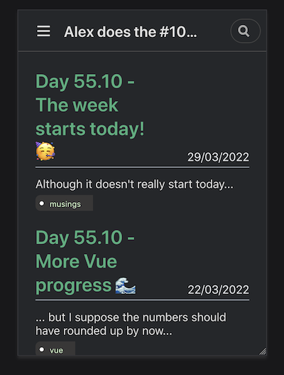
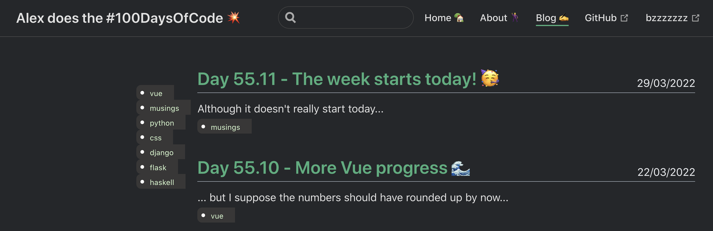
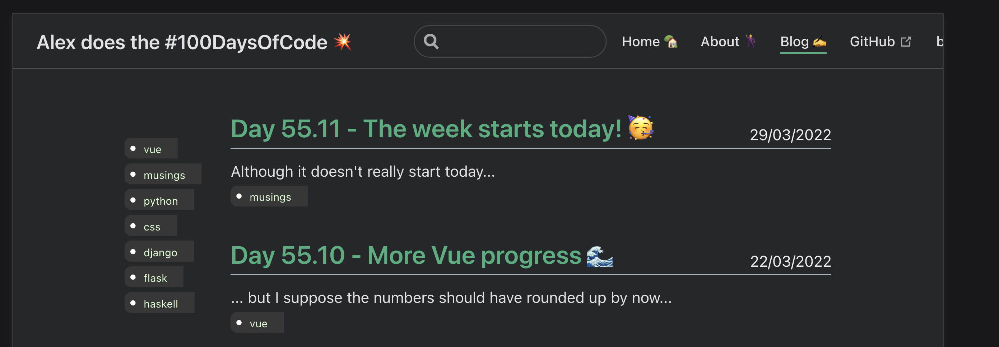

# {{ $page.title }}

*the following was written on* bocals-iMac, *at 12:47:59*.

Well, hello! A very busy weekend just happened to pass by, with *a very different activity from the usual programming*. So, after a round-trip home and back in Lisbon, I find myself wanting to plan the week ahead, but *on a Tuesday*. I notice some issues which need a proper fix real soon — and I plan to tackle them all before I have to leave *again* this next weekend. 

### bzzzzzzz doesn't default to HTTPS 🔑

For some reason, it still accepts unencrypted connections, which in turn will make some of its services fail (the fetching of the current song). This is not good — probably some `nginx` misconfig?

### prepare a Django service for deployment 🌊

In the last couple of weeks I designed a new website for [yet another big part of my life](https://polar-stream-47175.herokuapp.com/); it is currently live, but many things are still missing: proper fonts, and the forms must be working. Also, Heroku is good for testing, but not the best platform for production. It seems a little slow.

### finish what should be 1.0 of the Vue application 👨‍🎨

It is close to being concluded! My Vue skils have certainly improved during this process, and barring some minor quips with the code, all is going very smoothly. 

# Getting tags filtering on the blog page ⏳

This has been on the backlog for a while, and I think I'm good enough at Vue to handle this easily. I want to be able to filter by tag on the Blog page. 

One way to do this could be to have all tags on the side, with the possibility of filtering by clicking on them. Not so sure how I could go around to implementing this on mobile, as the view is already too crammed (and I probably should fix this enormous font size).

Maybe a scrolling bar with many tags, above the blog posts, could do the trick? (I think it's good practice to plan everything beforehand before moving onto the code.)

## First step: adapt the Blog view to display the `tagsFilter` component 🖼

A good trick to make responsive elements is to change the display flow of the elements on the page. I imagine the main (desktop) page could be akin to the current one, with the tags filter stickied to the left side (maybe with an absolute position?); as soon as the resolution (width?) falls below to a certain threshold, it should transform into a `display: flex; flex-direction: column` structure. 

After a good hour of work, this is what I ended up with:

Which is far from ideal: I'd like the tags to fill the available space in the left margin, cascading down as needed; plus, the blog posts should keep themselves centered. The above screenshot is the full page width, and one can see it is clearly way off.

[This seems like a great resource to use](https://every-layout.dev/demos/sidebar-media-object/). I'll give it a look!

# Further progress on this 🙈

*the following was written on* arpaeden, *at 23:22:31*.

I had some spare couple of hours, and this seemed fun enough to tackle in the end of the day (a very literal end of the day).

After some CSS tricks, I realised two things: one can only get so far in Vuepress without messing with some under the hood things I'm really not aware of — that's the first one — and the second is that *I'm getting quite handy at this*. The tags are working *well enough* both on mobile and desktop versions, but the design (specially the desktop) swayed a little too far from what I initially expected. But not too bad for half a day's work!

<FetchComments :title=$frontmatter.title />
<PostComments :title=$frontmatter.title />
