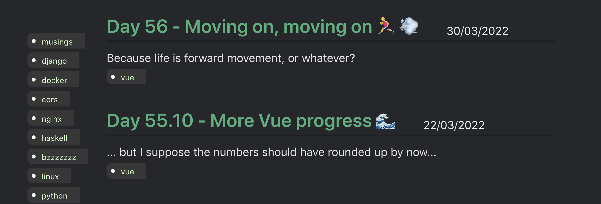

# {{ $page.title }}

*the following was written on* bocals-iMac, *at 10:45:54*.

Tough morning! In any case, here I am again. And moving forward, because...yeah? Time, and all.

Yesterday I had lots of good progress on the design part (which is practically finished, or a very decent MVP in the worst case scenario). For today, I'm planning on implementing proper filters.

## How to, Alex? 😲

Well, first maybe I should have a wide overlook over the current codebase. 

This is the relevant part from the blog component (and I actually notice *a very silly mistake*, but I'll see if it slides!):

```vue
<div class="blogPosts">
  <div class="post" v-for="post in posts">
	<div class="postInfo">
	  <router-link :to="post.path">{{
		post.frontmatter.title
	  }}</router-link>
	  <time style=""> {{ processedDate(post.frontmatter.date) }} </time>
	</div>
	<div>{{ post.frontmatter.description }}</div>
	<div class="postTags" v-if="'tags' in post.frontmatter">
	  <ul class="tag" v-for="tag in getTags(post.frontmatter.tags)">
		<li>{{ tag }}</li>
	  </ul>
	</div>
  </div>
</div>
```

So, the `for` look is quite important; it is looping over `posts`, which is a `computed` property. 

```vue
posts() {
  return this.$site.pages
	.filter((x) => x.path.startsWith("/blog/") && !x.frontmatter.blog_index)
	.sort(
	  (a, b) => new Date(b.frontmatter.date) - new Date(a.frontmatter.date)
	);
},
```

It seems like the `filter` is the most important part. As it is, it is taking all the content of `this.$site.pages` (more on that later, but I assume these are all the markdown files), and selecting everything whose path starts with `/blog/` and *is not* the blog index (which is a special file, identifiable by its frontmatter). So this is just *the default condition*; I feel like another condition can be appended with the logical *and*, in which tags could also be filtered. The `sort` is actually okay and works quite well. I'd still like the posts to appear in chronological order, so that is fine. 

As for the `$site` variable, that was quite confusing; there was a lot of contradictory information on the web. Is suppose the `$` stands for special variables of some sort. But to get more information, one can just easily render the `$site` variable — it's just a Javascript object with all the necessary information of the blog posts.

```
{"title": "Alex does the #100DaysOfCode 💥", "description": "", "base": "/", "headTags": [], "pages": [ { "title": "Alexandre thinks #100DaysOfCode is a really good idea...", "frontmatter": {}, "regularPath": "/", "relativePath": "README.md", "key": "v-6c545182", "path": "/", "headers": [ { "level": 2, "title": "To-Do (in the very near future)", "slug": "to-do-in-the-very-near-future" } ] }, { "title": "Day 35.5 - Proof of life 🌷", "frontmatter": { "title": "Day 35.5 - Proof of life 🌷", "date": "2022-01-10T00:00:00.000Z", "description": "I'm still alive, and very much kicking!", "tags": "musings" }, "regularPath": "/blog/011022.html", "relativePath": "blog/011022.md", "key": "v-6eef2f5c", "path": "/blog/011022.html", "headers": [ { "level": 2, "title": "The good stuff!", "slug": "the-good-stuff" }, { "level": 3, "title": "Icecast is up and running — really well, too! — and bzzzzzzz is now very responsive! 🛰", "slug": "icecast-is-up-and-running-really-well-too-and-bzzzzzzz-is-now-very-responsive-🛰" }, { "level": 3, "title": "My Javascript and front-end chops have increased immensely 🎨", "slug": "my-javascript-and-front-end-chops-have-increased-immensely-🎨" }, { "level": 3, "title": "It helped me keep track of things! And I feel my English has improved, too. ✍️", "slug": "it-helped-me-keep-track-of-things-and-i-feel-my-english-has-improved-too-✍️" },
```

### Working the code out 🏋️‍♂️

The `$site.pages` variable includes all the blog posts, and the tags are accessible through the `frontmatter` of each post. I'm keeping the aforementioned `posts` function, but with an extra condition. 

```vue
    posts() {
      return this.$site.pages
        .filter(
          (x) =>
            x.path.startsWith("/blog/") &&
            !x.frontmatter.blog_index &&
            (this.filteredTags == [] ||
              x.frontmatter.tags
                .toLowerCase()
                .split(",")
                .some((elem) => this.filteredTags.includes(elem.trim())))
        )
        .sort(
          (a, b) => new Date(b.frontmatter.date) - new Date(a.frontmatter.date)
        );
    },
```

(the formatting was done by the Prettier extension; it really might look *just a little better*).

Now, the above code wasn't working, and it took me a fair while to debug; only afterwards did I realise `this.filteredTags == []` is not a proper test for list emptyness; it works after testing for the length being zero. I can test the code is working by manually changing the `filteredTags` variable to include a few tags. 

**So what do I have so far?** a component that filters posts reactively according to a list of tags. **And what's the next step?** Be able to click the tags to filter!

### From parent to child component 🧒

First, the parent component passes down the available tags to the child component: this aids in building up the list of available tags. The code is not the best; I'd rather make it functional for practice, but I can see how it gets very messy when accounting for possible mismatches in capitalization and space trimming (my tags are usually in the form `tags: Docker, mpd, linux`, instead of `tags: docker,mpd,linux` — but this doesn't seem as natural to write).

```js
allTags() {
  return Array.from(
	new Set(
	  this.$site.pages.filter(
		(x) =>
		  x.path.startsWith("/blog/") &&
		  !x.frontmatter.blog_index
			.filter(
			  (x) =>
				x.path.startsWith("/blog/") && !x.frontmatter.blog_index
			)
			.map((x) => x.frontmatter.tags)
			.join()
			.toLowerCase()
			.split(",")
			.map((x) => x.trim())
	  )
	)
  );
},
```

there is some duplication in getting the blog posts — that represents a fair amount of the method's code. Maybe I can solve that in a refactor? 🥵

```js
allBlogPosts() {
  return this.$site.pages.filter(
	(x) => x.path.startsWith("/blog/") && !x.frontmatter.blog_index
  );
},
allTags() {
  return Array.from(
	new Set(
	  this.allBlogPosts
		.map((x) => x.frontmatter.tags)
		.join()
		.toLowerCase()
		.split(",")
		.map((x) => x.trim())
	)
  );
},
```

Oof! This looks a lot better! 🥳 and the `allBlogPosts` can be reutilised on another method too.

Passing the `allTags()` result as a prop works quite well with just `<tagsFilter :allTags="allTags" />`, which is, quite frankly, mindbogging — but maybe this is a feature of Vue, somehow?



This visual layout clearly doesn't work too well with this sort of vertical disposition; althought it actually looks very fine on mobile resolutions. This is something for which I've found a quick fix, but to solve it in a deeper fashion I think I should get really deep into Vuepress internal theming — and I have no idea how that works. 

But, in what the component is concerned, we're moving on!

*the following was written on* bocals-iMac, *at 15:16:34*.

## Communicating back up! 👨‍👦

I'm thinking of adding an event listener to every tag on the sidebar, making it emit information to the parent component, and enabling it to both toggle and untoggle a selection. 

```js
<template>
  <div class="tags">
    <div
      v-for="tagElement in allTags"
      class="tag"
      @click="activateTag(tagElement)"
      :data-tag="tagElement.InnerHTML"
    >
      <li>{{ tagElement }}</li>
    </div>
  </div>
</template>

<script>
export default {
  name: "tagsFilter",
  props: ["allTags"],
  data() {
    return {
      selectedTags: [],
    };
  },
  methods: {
    activateTag(tagElement) {
      if (!this.selectedTags.includes(tagElement))
        this.selectedTags.push(tagElement);
      else {
        const index = this.selectedTags.indexOf(tagElement);
        if (index > -1) {
          this.selectedTags.splice(index, 1);
        }
      }
	  console.log(this.selectedTags);
    },
  },
};
```

So far, I can click tags and add/remove them from an array. This array will be emitted upwards, to act as a filter of tags. Notice how the `@click` event works, and how I fetch the tag information by using the `.InnerHTML` selector.

I'd like to have some visual indicator of whether a tag is selected or not. That is, too, quite easy to implement. 

[This has been done before](https://www.alexmakes.codes/blog/032122.html#the-resulting-code), in a way; is this documentation any good? 

<FetchComments :title=$frontmatter.title />
<PostComments :title=$frontmatter.title />
