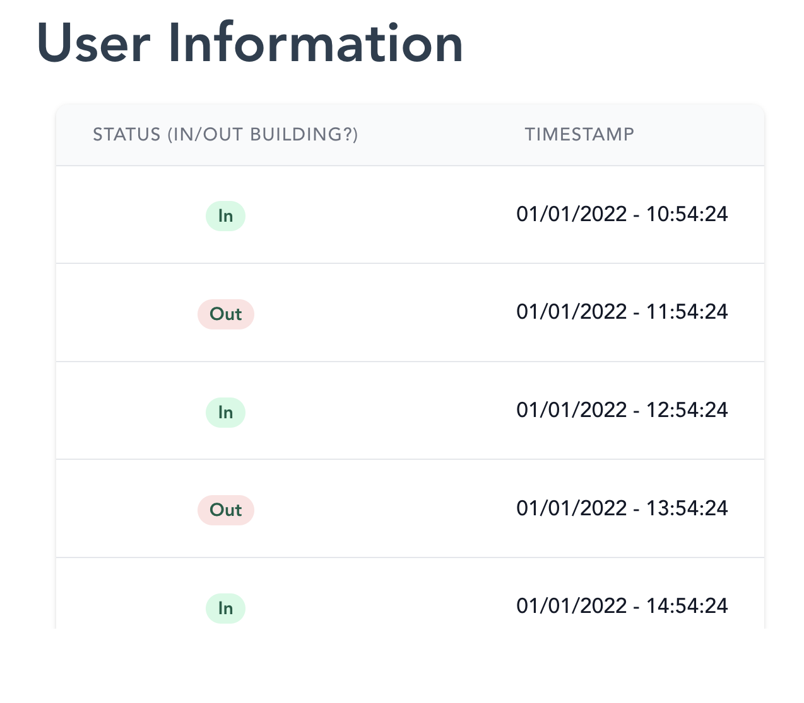

# {{ $page.title }}

Today I'd like to feed custom data into the Postgres database. This way I can rely on my own data to produce statistics, without being worried about the correctness of whatever the API is fetching. 

The first step is ensuring I can connect to the Postgres instance. We're working with Docker containers using the `docker-compose` architecture, so it is quite easy to see which container is running the Postgres instance, and run a shell on it. `psql -U <POSTGRES_USERNAME>` will launch a shell onto the database; and I'm in!

### Which data to add? 🤔

Having gained access to the database, I must now create entries that will help my testing. I need a card, then a user associated with it, and finally some entries. This seems all pretty trivial. 

This creates a user!

```postgres
INSERT INTO "users" ("created_at", "updated_at", "deleted_at", "cred_id", "token", "first_name", "last_name", "intra42_login")
VALUES (now(), now(), NULL, NULL, 'randomstring9c3:1234567889.234569069', 'James', 'Acaster', 'jacaster')
```

And now, some logs.

```postgres
INSERT INTO "logs" ("created_at", "updated_at", "deleted_at", "row_id", "cred_token", "user_token", "door", "enter", "time")
VALUES 
(now(), now(), NULL, NULL, 'randomstring9c3:12345567.819238123', 'randomstring9c3:12345567.819238123', 'P0D', '1', '2022-01-01 14:54:24.665712+00'),
(now(), now(), NULL, NULL, 'randomstring9c3:12345567.819238123', 'randomstring9c3:12345567.819238123', 'P0D', '0', '2022-01-01 15:54:24.665712+00'),
(now(), now(), NULL, NULL, 'randomstring9c3:12345567.819238123', 'randomstring9c3:12345567.819238123', 'P0D', '1', '2022-01-01 16:54:24.665712+00'),
(now(), now(), NULL, NULL, 'randomstring9c3:12345567.819238123', 'randomstring9c3:12345567.819238123', 'P0D', '0', '2022-01-01 17:54:24.665712+00');
```

With this, I can create as many users and logs as desired — it will appear on the front-end without much hassle.



This is great! Now, ideally I'll ensure this gets fed into the database every time it loads, but I cannot think of any cool way to make it happen right now. And it's not a priority, anyway — let's move on! 🏃‍

## Handling the statistics part! 📊

<FetchComments :title=$frontmatter.title />
<PostComments :title=$frontmatter.title />

