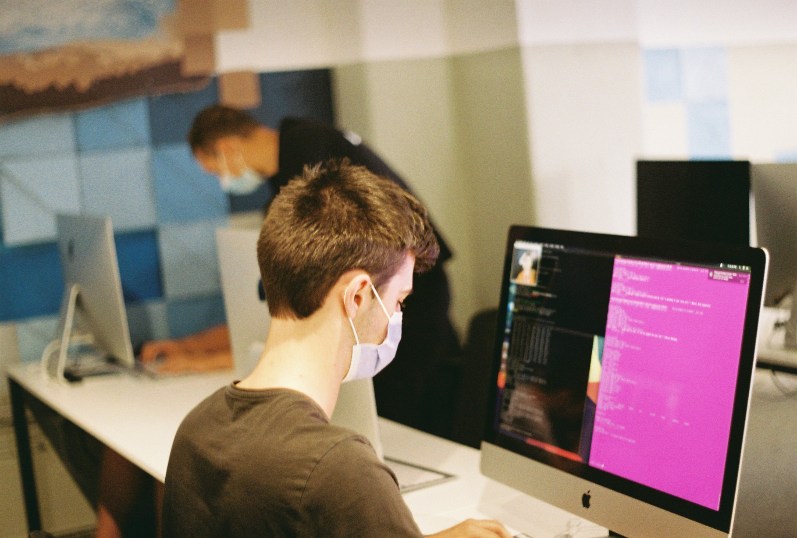
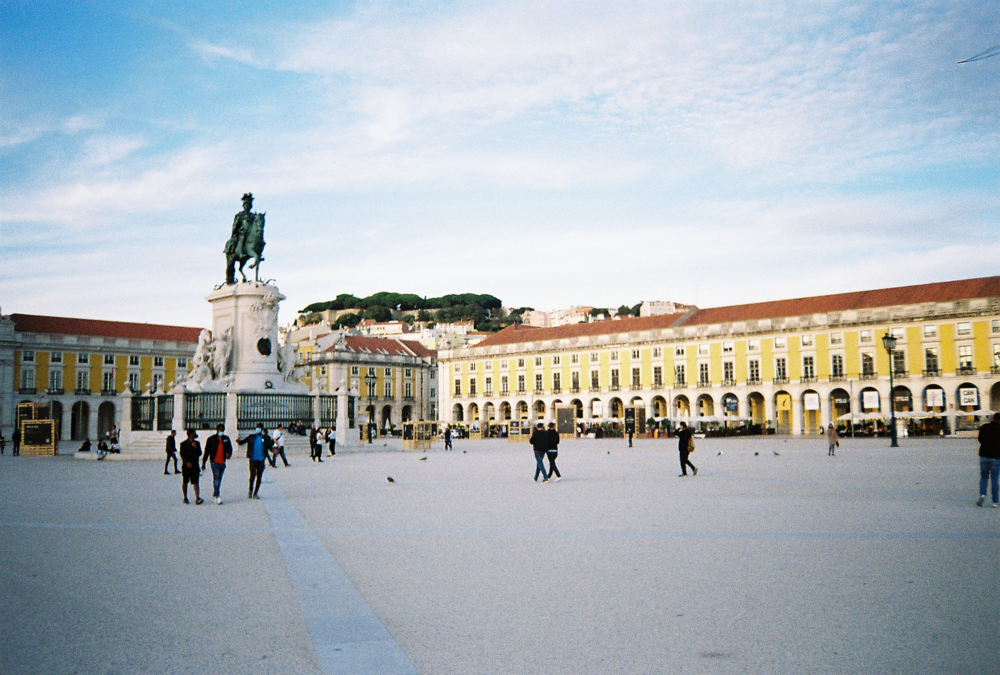
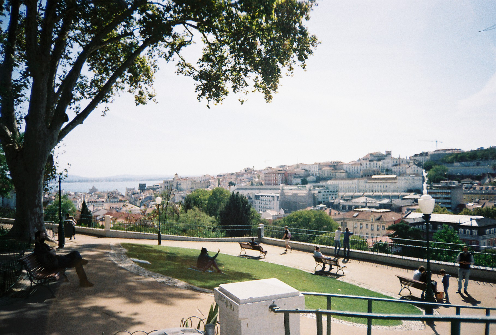
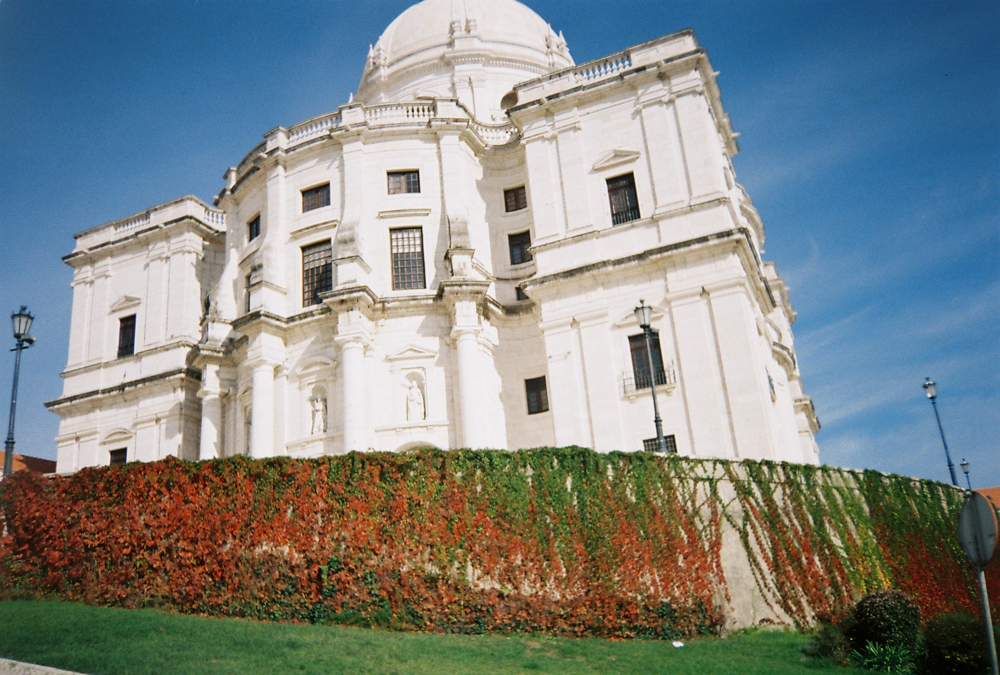
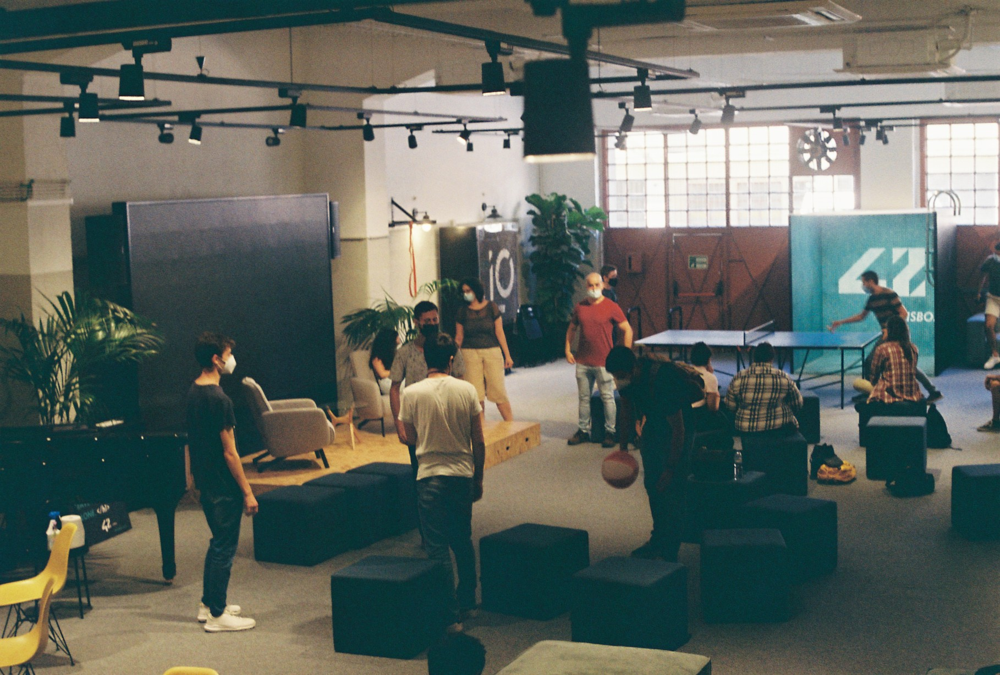
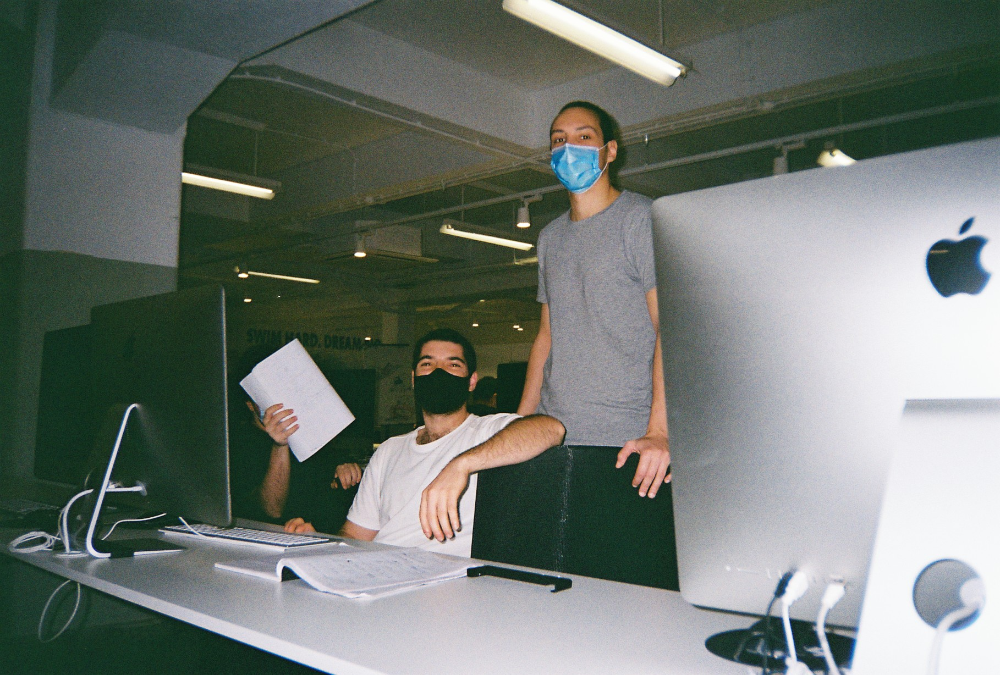
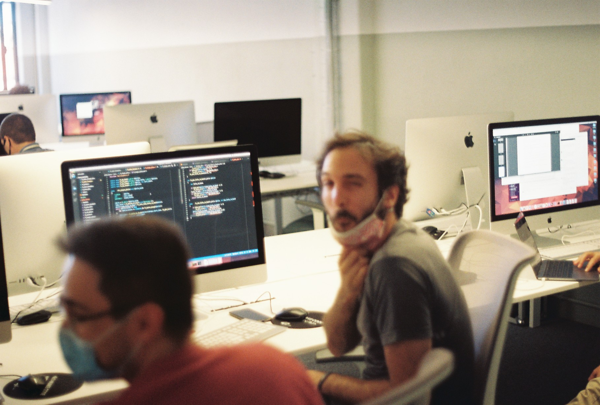
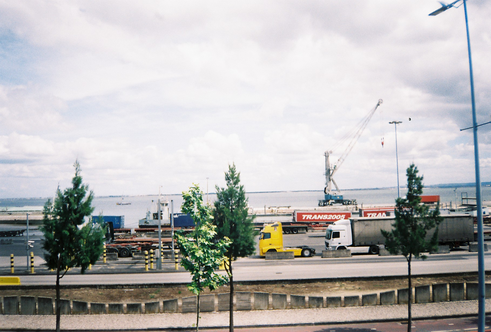

tl;dr: 42 is a really cool education project targeting people with interest in programming; it is free and has no teachers (yes!); the model works; employment rates are very, very high. It seems to good to be true — but luckily, it is true! 🙌

# {{ $page.title }}

Well, well, well: a writing of this sort has been overdue. As you know — or, frankly, might not, given how sparsely has this blog been updated — I've been both studying at, and now also working with **42Lisboa**. As a matter of fact, I was one of the first candidates to do the *piscine* (October '20, more on that in a little bit); did oficially start the cursus in early February of '21; and did also, at some point along the journey, transition into being a *lifeguard* at the institution (more on that in a bit, too).

So... time flies ⏳ It's been almost a year and a half since my moving out to Lisbon; not only that, but **42Porto** is soon materialising — and my own relocationing to Porto following suit —, which introduces a lovely opportunity to both reminisce and digress about the experience so far.

### What was before, Alex? (or, *bonus credit introduction for those really invested in my storytelling*).

#### ...*mathematical frustration, the pandemic, and free time enter a bar and...* 🤸
I distinctly remember the general state of affairs before this spell in Lisbon began: there was a struggle with my university degree (Bachelor in Maths), where I was as close to finishing the course as I was enthusiastic about pursuing another couple of months of intense cramming and zigzagging among books, and some other authorities, on Partial Differential Equations.

— (to make it abundantly clear: not much enthusiasm abound, alas) — 

The pandemic had been raving and raging around the country for the better part of the previous five months, and the sudden change in environment (away from presential classes, and closer to nature, with *plenty of free time*) led me, as with many, to reconsider my life choices 🧘

#### a brief telling of past programming experience  🖥️
To be fair, my interest in programming had shown a little earlier than that — at some latter point in the whole of the seven years that my college education spanned, I attended a couple of classes in C programming and dabbled in some Python exercises — but only then, in mid March of '20, did the world as we knew appear to crumble, and allow for the uninterested exploration in the field, day after day after day, as Spring blossomed around 💮 and time seemed infinite (remember: we were under lockdown).

#### and then, Spring came🌻 — cue birdsong, and all 🐦
The forthcoming months came to be of the most productive, prolific, happier, meaningful I had ever had so far. Having my computer as companion, I set out to devise [a new cyberhome for a pet project](https://bzzzzz.buzz), tackled some of [Harvard online courses in AI + Python](https://pll.harvard.edu/course/cs50s-introduction-artificial-intelligence-python?delta=0), and soon found myself looking at job listings, or further education opportunities, in the tech field. Real jolly times! 🙌

At some point there were talks with one particular company, and even a couple of interviews, which led me to believe I had struck the path of employment in one of Portugal's tech unicorns 🦄 however, it did not work out as such in the end — and in hindsight, not as unfortunately as I had believed back then — as I did, on the very same day, learn about a new educational project, with no teachers nor classes nor fees nor schedules, which seemed both very much up my alley and too good, too really really good, to be true. 

## What 42 is all about 🗺️

It didn't take long for me to check out their website. After signing up on the platform, I took a couple of days to learn about the 42 project. It started in France, back in 2012 or so, and has now expanded to upwards of fifty schools around the world 🌍 the model is the same wherever: **no teachers and no classes**, relying instead on the students ability to collaborate among themselves in the pursuit of knowledge; **students get evaluated by their peers**; and, maybe most important of all, *one proceeds as slow, or fast, as desired*. 

The cursus (after the admission process) is divided into three big stages: at first, one tackles the **common core** — mostly C, some shell/Unix/Linux technicalities and C++; at the end, there's a bigger project that entails some front-end techniques, too. After the common core, there's a (paid!) curricular internship at a willing company — and there's many companies willing to receive 42 students! 🙌 —, and then one comes back to specialise in one of many areas of expertise, ranging from cyber security to data analysis, embedded systems, front-end...anything, really! 

### a brief note on certification 🗞️
People often ask if the school gives any sort of certification; it does, of course, certify you as alumni of 42, but this is not formally equivalent to college education *for all burocratic matters* (even though you learn as much as, if not more than, the traditional university system). However, rest assured every single worthy tech company knows what 42 is — and they, most likely, already have had positive experiences with 42 alumni.

I was still under the impression this was slightly bonkers, really  🤪 so after a couple of days, I took a chance on the two online tests required for starting the enrollment process.

### taking the online admission tests 📜
The first one was very straightforward and short — very akin to the Simon Says memory game, where one must quickly memorise a pattern and reproduce it. Almost like a glorified *captcha*. But the second one, though...the second one gets serious *pretty fast*. It is presented as a sort of logic game where one must provide some instructions to a spaceship, which must get from start to finish. The instructions are very, very similar to what any imperative programming language would look like (do this, do that, loop here, finish then), and of course it helped to be exposed to that sort of logic before. But rest assured: **the tests — and the cursus — are designed with the utter novice in mind.**

Soon after the confirmation email hit the inbox — I had passed! 🥳 — and was thus invited to come and presentially visit the campus.

### checking in with the campus 🏫

I'm not sure how long after did I spend a day and night in Lisbon — probably just a couple of weeks after? I scheduled an Airbnb in the Mouraria zone — and ha, what a fun night that was! 💃 — to cap off the afternoon spent at the campus, which sits between the lively Rua Morais Soares (where I'd later live) and the hilly Penha de França. And it was, indeed, *too good* — unbelievable good, really! 🌄

The school finds itself inside what was once some sort of industrial building, with lots of open, wide spaces; there's a lounge with some table tennis, a piano, and plenty of cozy couches (where some naps were had 🤫); and above that, two clusters of perfectly aligned computers, amounting to three hundred or so, free to the use (and mild abuse!) of any student, at any of the 24 hours of the day (**the campus really is open 24/7 — one can come it to work anytime!**). On top of it all, there are two pantries to prepare meals, plenty of individual, sound-proof study rooms, and a breathtaking rooftop that puts many Lisbon sunset parties to shame — a place where both the morning and the setting sun are great companions to yoga practices. Take my word for it!

I didn't sleep too well that night. I grant that Mouraria is not exactly the quietest neighbourhood in the city, but my mind was hopelessly pedalling back and forth in a river of excitement: could it be that, for once, **I had found a place which did not impose its schedule, its set way of doing things, instead allowing for more freedom of planning and execution, where one could (and would!) follow the lead of their inner rhythm?**

### scheduling the piscine — and what's up with that, really? 🏊

As soon as one does the check-in after passing the tests, a set of dates present themselves to pursue the last test before enrolling in the school. This is the ultimate cotton test, if you will: **twenty-six consecutive days**, with no less than **150 peers** (!) at all sides around, fostering a very special spirit not of competition but cooperation in tackling the school's course. Behold, the *piscine*! 🤽

What one finds, from the first day until the last, is a set of carefully devised challenges, with an accompanying carefully devised set of provided information. And off you go, really, in the pursuit of knowledge! 🙇 you read, you learn, you try, you fail — many times, indeed... —, and, *eventually*... you'll strike success. It *is tough*; but, too, very rewarding. 

Again I state: the whole *piscine* experience is designed with the utter novice in mind (of course it helped, in my particular case, to be acquainted with C, Unix, the shell, etc. — but **there were many, many cases of fellow peers having no prior experience in that and getting along just fine**). 

### general recommendations for a pleasant stay 🥰
I think all official communication from the school will recommend that one undertakes the piscine full-time; ie., without any other responsability that might rival it in time spent. And while it certainly won't hurt to have it so, in many cases — such as mine, and many other students — that is just not possible! 

If you do find yourself in that position, **do not fret** — it is definitely possible to make it through the piscine in those circumstances! Do keep one thing in mind, though: although you certainly can work and learn from home, you'd do yourself a disservice by not interacting **heavily** with your peers — they benefit just as much as you do from the experience! 🎈 not only that, but every evaluation, whether it is each project's evaluation or the weekly exam (every Friday from 6pm onwards; last exam from 10am onwards), **must occur presentially**. This is non-negotiable.

### and what does exactly the piscine test? 🤔

Now, that's the million dollar question whose answer is definitely not set in stone. 

I'd say it tests not only one's programming ability, but more so one's **ability to learn**; it is also indirectly testing one's social skills — because the piscine is, ultimately, a *very social experience* — and resilience, too — because *it can get quite stressful*. And as for the latter part, let me make it perfectly clear: **I don't believe in stressful learning or working environments**. The *piscine* is not, by itself only, necessarily stressful; but it certainly does require special care and handling, and that is why I would recommend **eight hours of sleep**, **regular exercise** and **healthy eating**. Let's not glorify bad habits, please! 🌈

### the calming of the tides 🌊

After the *piscine* ends...you rest. For quite a while. If all went accordingly to plan, there were lots of project submissions — and not all passed... —, *some* exams were taken and finished, you now're now ahold of *some* knowledge of programming (and C in particular)... and there's hopefully enthusiasm with regard to being a proper student at the 42 School. 🥳 the last step of the admission process is *to wait* a week or so for the results to come in. Be sure to check in with your *piscine* colleagues in the meantime! 🤽

In hindsight, I can comfortably tell that the *piscine* alone is **one of the most exciting programming experiences you can undertake**. Nowhere else can one have such a deep dive into the programming world, both in the technical education and the physical experience of being *in close quarters with so many potential coders/learners* ; having learned not only about code, but too about how you personally handle the good and the bad of *learning* by oneself.

The following statistics are *sort of* public: for any given *piscine*, usually a third of the candidates will give on their own initiative — because they didn't enjoy or fit the learning model, or just plain disinterest with programming. And if by any chance you fail the admission process, you can retake the *piscine* after a year has passed. 

## Being a student! ✍️

I enrolled as a student in 

## Finishing notes, and whatever 🚲

### education can be a lot of things at once;
The whole 42 experience triggered a profound curiosity with how education works, and alternative forms of learning. It made me question the habitual educational itinerary from infancy to early adulthood. I think self-learning is severely underrated in our society, and this is now a very passionate subject for me.
### the school gets its funds from private investors. That is how it is free! 
This is much more important than just a brief footnote; on the other hand, it's not something that I personally feel has any impact in the 42 experience. To keep it short and simple: I came to believe that we are currently living in a capitalist setting; and programming is, at this specific moment in time, something highly sought after and valued. I find it empowering; some people don't feel as excited about that. I'm happy to talk about it, too.
### if you want to leave a comment, do so,
unless of course the website broke up. In any case, I'm reachable at apinto at 42porto ponto com (that's an email).

<FetchComments :title=$frontmatter.title />
<PostComments :title=$frontmatter.title />

