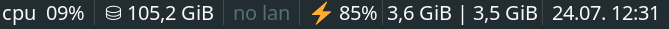
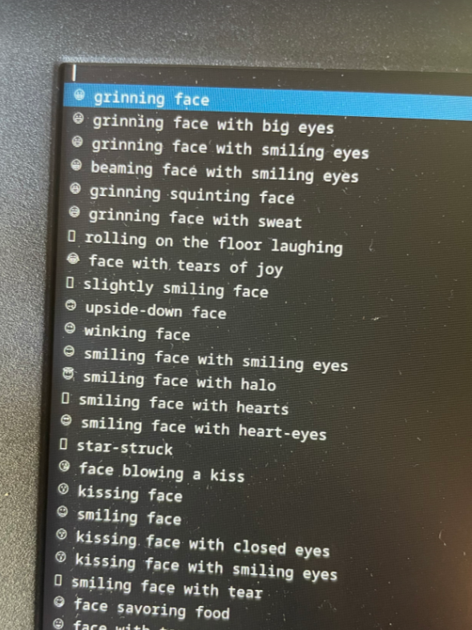

# {{ $page.title }}

Well, life has changed quite a while in the last couple of months. I'm not in Lisbon anymore, and am currently based in Porto; my living quarters aren't shared anymore — I currently inhabit *a whole space of my own!* 🥳 — and lots, lots more. My responsibilities at the school have escalated quite dramatically and thus it has been hard to find time to code. Or motivation, really.

This sudden change triggered some reflection in my life; the usual *where am I, and where am I heading next?* yadda yadda. Not all is bad, but neither is everything good. Life is dissatisfacton, too. [This helped get a chuckle at my very deep and serious problems](https://www.youtube.com/watch?v=d8fTJEozHCs). I've got some opinions on technology that directly interfere with how I chose to make a living. So there's that.

On some other quite unrelated news, I'm really enjoying my Thinkpad more and more. It hasn't been smooth sailing every day (Manjaro has its quirks) but it *really does act and feel* like a work machine — MacOS really pales in comparison, specially in the responsibility each OS attributes each user. In all honesty, I think I'd happily change to Linux 100%, but there's still some great proprietary software over at the Apple side in which I rely on (Gimp cannot yet properly rival Photoshop, and Audio Hijack is a great tool for audio mixing and broadcast I have yet to substitute).

## Finally a fix for emojis on the terminal! 🤩

Sometimes I lose a lot of time trying to configure this. There's a new desktop machine at my workplace which I've converted into a Manjaro build too; then I had to face the issue of transplanting all my config files over there (and there's already some stuff: `i3` configs, `zshrc`, `nvim`, etc.). I spent some minutes trying to make `rsync` do the job, but it seems like `syncthing` is a great Open Source solution that will ideally make it work effortlessly. And today I tried tackling my lack of emojis — and finally succeeded! Emojis are finally displaying on the terminal (I use `kitty`), and therefore they're working on `nvim` too ✨


It was definitely not straightforward to get this to work — I think font handling is still better done on MacOS, too. So, I'm using [Twemoji](https://aur.archlinux.org/packages/ttf-twemoji), and maybe it was my lack of experience, but the usual `makepkg` business didn't install these properly. I tried many things before manually placing the `Twemoji.ttf` file under `/usr/share/fonts/TTF/`, which did the trick for displaying emojis system-wide (I even have an emoji on the status bar below, showing the battery percentage)



This was not all, though. I've also been using [Luke Smith's emojidropdown plugin for dmenu](https://github.com/LukeSmithxyz/voidrice/blob/master/.local/bin/dmenuunicode), but emojis didn't properly show up on that menu either.



To fix this, Luke suggests downloading the source code for `dmenu`, but I still had to do the additional step from [this forum post](https://bbs.archlinux.org/viewtopic.php?id=255799) to allow for emojis to show up. This was quite fun — albeit very guided, it was the first time I properly delved into C code to customize or fix my build. 

```c
static const char *fonts[] = {
	"monospace:size=10",
	"twemoji:size=10",
};
```

A `make clean install` will substitute all the binaries. And now, I got emoji working all over! 💯

<FetchComments :title=$frontmatter.title />
<PostComments :title=$frontmatter.title />

