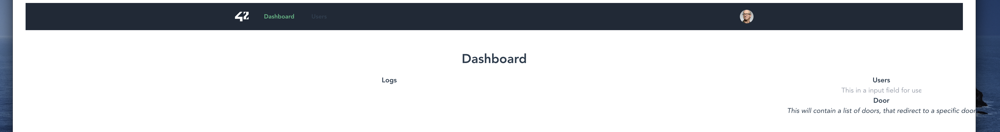
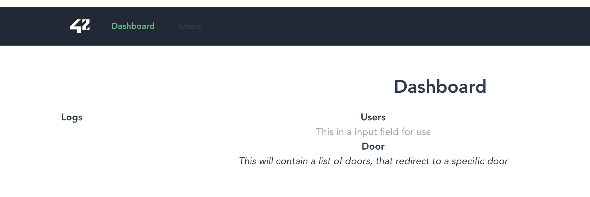

# {{ $page.title }}

Yesterday I stopped coding early; the night is settling in at 6pm-ish, and it makes me anxious to code with no sunlight. It is high time for adaptation, though - have you heard of [blue-light blocking glasses](https://www.amazon.co.uk/Sleep-Savior-Red-Night-Glasses/dp/B07CZ2Q8XW)? 😎

# I started the day with the raycaster...

...and the code is still a broken mess. Every time I pick it up, I wonder - will it ever end? Will it ever *work*? I know there are some simpler implementations out there, but I won't pull the trigger before ensuring there are no possible bugs I can track. Today a few were found, with painstacking printf-based debugging. Let's see what tomorrow will bring: one hour was enough for today.

# On to fixing some front-end bugs! 🐞

Yesterday two bugs appeared when introducing the router: the NavBar broke its formatting, and one of the pages completely messed up its grid. The first one was rather easy to sole: when adapting the NavBar to render the routed links, we forgot to keep the applied CSS classes - I went back to the previous commit, copied the classes and pasted over to the new code. It is not quite how it was, but it no longer appears broken, and thus I'll keep it this way (for now). As for the second one, it is a little trickier, and *weird*: how did routing break the page appearance?

At first it seems like the Logs square is way out of proportion, but notice how the content in the right-area tends to span the whole page; after some time changing values in the CSS, reading the Inspect panel and trying different stuff out, it crossed my mind that the issue is not on the grid itself, but rather how *the content sprawls horizontally across all the page*. It occured me to equip the `parent` div with `max-width: 940px`, to ensure the content doesn't occupy more than what it should.

The picture above shows how the content is now tied to the left-most part of the screen; from this I inferred the content is not being centered by default (which is actually what many websites do, leaving much of the margins without any content). To get a reference of working code, *I checked this blog's CSS* - it is implemented beautifully! - and saw the magic `margin: 0 auto`. A quick ~~Google~~ search on DuckDuckGo 🦆 [yields this informative answer](https://stackoverflow.com/questions/3170772/what-does-auto-do-in-margin-0-auto) on the merits of `auto`.

::: tip 
*from **Stack Overflow***

"*When you have specified a width on the object that you have applied `margin: 0 auto` to, the object will sit centrally within it's parent container.*"
:::

So that fixes the misalignment on the page! But, alas, just after trying to add another page to the router, it completely broke the design of one of the pages. Front-end can be very tricky sometimes. 😩

# Some miscellaneous fixing 🚲

In the afternoon, I managed to solve some miscellaneous problems that were lying around. The Heroku **deployment of the Discord bot has been fixed**; considering how difficult it was to make Heroku handle command line arguments, the implementation was changed to rely on environment variables (it seems like a more sensible solution, anyway). On the other hand, this website was having **trouble with rendering untilted images** - I think this is more an issue with Vuepress than anything else, really - and it's now fixed too! ✨
