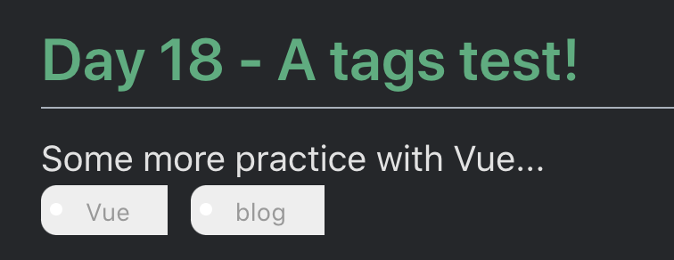
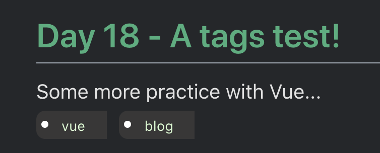

# {{ $page.title }}

I want to get tags working. This will help immensely with tracking down content in past posts - plus, it's probably very easy to set up a quick graph that shows how I allocate my time across all the undergoing projects.

The blog posts are rendered through Markdown files, and all the parsing is handled with Vuepress; this means I don't really have access to whatever is happening under the hood. I do have, on the other hand, a `frontmatter` to every blogpost; it's easy to add a `tags` line, and place them separated by commas.

```
---
title: Day 17 - A tags test!
date: 2021-11-24
description: Some more practice with Vue...
tags: Vue, blog
---
```

(notice the subtle space behind the `b` in blog - that will be handled too, with a `strip()` method!)

The next step entails changing the Blog component to access the tags (using `post.frontmatter.tags `), split them (`getTags(tagsLine) {return tagsLine.split().map(x => x.trim())`), and then render them separately: 

```html 
<div class="post" v-for="post in posts">
	<div class="postInfo">
		<router-link :to="post.path">{{ post.frontmatter.title }}</router-link>
		<time style=""> {{ processedDate(post.frontmatter.date) }} </time>
	</div>
	<div>{{ post.frontmatter.description }}</div>
	<div class="tags" v-if="'tags' in post.frontmatter">
		<ul class="tag" v-for="tag in getTags(post.frontmatter.tags)">
			<li>{{ tag }}</li>
		</ul>
	</div>
</div>
```

Vue is now rendering the elements, but it still needs some cool CSS to properly style the elements. A quick search on Duck yields [a codepen repository with exactly what was needed](https://codepen.io/wbeeftink/pen/dIaDH); I am specially fond of the small white ball - it really makes it look like a real tag! - but had it implemented as a ``li:marker`` styling, instead of using the ``::before`` and ``::after`` selectors.  

Here are the results!



Of course, the next step is to properly handle the template colors, considering whether or not the dark mode is being rendered. It all depends on the `prefers-color-scheme: dark` CSS media feature, which can be targeted as follows:

```css
@media (prefers-color-scheme: dark) {
	.tag {
	  background: #383737;
	  color: #d9ffd2;
	  -webkit-transition: color 0.2s;
	}
}
```

This will override the default colors defined for the 'light mode'. Below is the final result - which is really much better.



And that is it! Tags are implemented (albeit only visually - next step would be to filter posts through tags...), and the dark-mode is fully implemented now (except for code in light-mode, which is iffy somehow).

<style scoped>
    img {
	width: 50%;
	display: block;
	margin-left: auto;
	margin-right: auto;
    }
</style>
