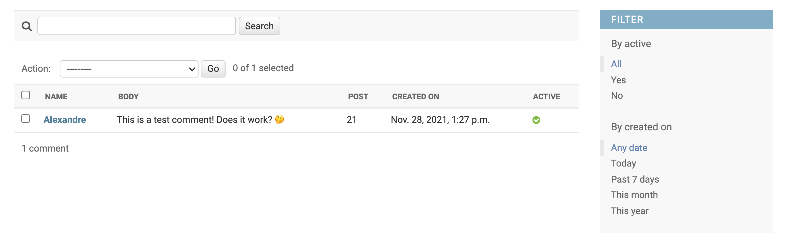

# {{ $page.title }}

# About remote work, and being consistent 🌳

[As you know](http://alexmakes.codes/blog/112521.html), I'm back home for a week. These small escapades aren't necessarily holidays, because there's a performance coming up — and that is very stressful just by itself, let alone if I consider all the work that was left behind in Lisbon.

I do very strongly believe in remote work, though, but there's a very strong sense of discipline associated with it. Moving away from a regular office and its routine, entails a lot of mental gymnastics to keep up with rhythm. 

# Tackling comments on the blog 👊

This has been on the to-do list for a while, and I don't think it will be possible with Vue alone — as there is always the need for a proper database, etc. I'm not interested in [importing plugins](https://vuepress-theme-hope.github.io/comment/guide/), so my choice is to make my own system using the **Django framework** for Python. To get more quickly acquainted with what the process, [this tutorial was (loosely) followed](https://djangocentral.com/creating-comments-system-with-django/).

Creating a Django project is done with `django-admin startproject amc_comments`. Since Django projects are built of apps, `django-admin startapp api` initializes an app - some sort of module, let's say, for the bigger project.

# The comments model 📝

Every Django app includes placeholder files for models, among others. Since, in essence, comments are content submitted on a set of text inputs, they naturally fit as objects in a database — thus, the first step is to define a **model** for the content.

```python
from django.db import models

class Comment(models.Model):
	id = models.AutoField(primary_key = True)
    post = models.PositiveIntegerField()
    name = models.CharField(max_length=80)
    email = models.EmailField()
    body = models.TextField()
    created_on = models.DateTimeField(auto_now_add=True)
    active = models.BooleanField(default=False)

    def __str__(self):
        return 'Comment {} by {}'.format(self.body, self.name)
```

By inheriting from the `models.Model` class, [many pre-made fields are available](https://docs.djangoproject.com/en/3.2/topics/db/models/), and this is very helpful to get things started quickly. The `id` of each comment should be unique, and [preferably automatically incremented](https://docs.djangoproject.com/en/3.2/topics/db/models/#automatic-primary-key-fields). The `post` will correpond to a day of the blog posts; all of the other fields are self-explanatory. The original tutorial implementation had some `on_delete` configurations, and also a Meta Class, but those will be left aside for now. 

# Making use of the admin panel 👨🏻‍💼

The `admin.py` is also created by default whenever an app is initialised. In it, one can register some models, which are then handled on a user interface accessed through the browser. Seems nice, so let's give it a go!

```python
class CommentAdmin(admin.ModelAdmin):
    list_display = ('name', 'body', 'post', 'created_on', 'active')
    list_filter = ('active', 'created_on')
    search_fields = ('name', 'email', 'body')
    actions = ['approve_comments']

    def approve_comments(self, request, queryset):
            queryset.update(active=True)

```

Once again a class inherits from a Django class — `admin.ModelAdmin` . [*The ModelAdmin class is the representation of a model in the admin interface.*](https://docs.djangoproject.com/en/3.2/ref/contrib/admin/#django.contrib.admin.ModelAdmin) - that's lifted from the official documentation. This is very useful! It looks like something akin to **Adminer**, but maybe a little more modern and customizable.



Thus far, comments are modeled on the database, and there's an admin interface to moderate the content. The tutorial stops here; the next step is building the POST and GET requests of the Django application.
