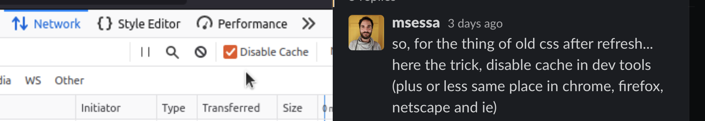

# {{ $page.title }}

## Life is cool, heh?

How is everyone else doing? Hopefully, good — but be wary and mindful, regarding the pandemic. Let's be kind to one another! 🙌

Life happened for a while; I mean, not that programming is not *a life, in itself*, but actual life *outside* of programming. To be fair, there was actually some computer stuff done, but it was mostly *optimisation of an interface* rather than real code.

## I did receive some feedback regarding this little Vue component below ⏬
<CommentsStub/>

*(first of all, let me say how lucky I am to have such knowledgeable and helpful friends - thank you, Gú and Michele! 🙏 )*

Michele showed me a very good way of handling CSS bizareness between refreshes.

For the second font problem, it did happen that I was able to notice, with Gú, how the font bug doesn't properly reproduce in the production server. In fact, it *only happens* when building it locally, which is weird. So, current status is: on production, everything is alright; when running *locally*, the dark-mode will display properly, while the light mode displays a monospace font.

Michele hinted at my font importing being somehow deficient — I am specifying the `Graphik-Regular-Web` font (and for no particular reason, really) — but the problem seems to be beyond that: I cannot seem to target the `textarea` element *at all*. 

And, too — what about the Vue component breaking completely if I switched the two elements? Michele reported not being able to reproduce this, but I did it again locally. Argh! So painful it is to do CSS! 💢

It turns out the problem was *quite* easy to solve. [There was a stray comma after one of the CSS definitions](https://alexmakes.codes/blog/112821.html), which was messing with the whole styling. It now works properly. 

🙃

### Things to do:
- scraper for Facebook video content;
- bug with nvim; global register is exporting badly? Unicode gets botched.

## Advent of Code 🎅

Having been out these last three days or so, I missed the start of the Advent of Code initiative — I am already two days behind. The exercises are all in good fun, but they can get quite challenging after maybe 10 days in: in fact, I apparently quit after day 10, but to be fair, last year's December was very, very busy. 

I hope to be able to make it further this time around, or at least the 10 exercises of last years'. The global discourse built around AoC is quite elegant and informative to spend time with.

However — just as it so irrationally happens with some other endeavours of mine — why not make this *much harder than needed*, using Lisp instead of the much-more-comfortable Python?

Let's see!
