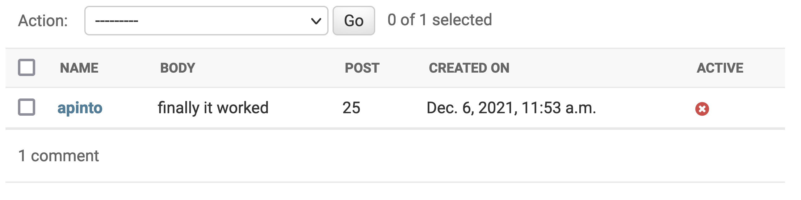

# {{ $page.title }}

## Working with Django models, and forms, and requests, and...

Remember, from some days ago, that I had setup a Django Model for the comments. It is useful to setup an accompanying Form, as, among other things, it will ease the validation process of each comment (which is still very naive - there is not much to validate when all the fields are `name`, `email`, and `comment`). Django provides for database-driven apps, as such is the case of our own, a [form that defines itself after a model](https://docs.djangoproject.com/en/2.2/topics/forms/modelforms/).

```python
from .forms import CommentForm
from django.http import HttpResponse
from django.views.decorators.csrf import csrf_exempt
import pprint as pp

@csrf_exempt
def post_comment(request):
    if request.method == 'POST':
        comment_form = CommentForm(data=request.POST)
        if comment_form.is_valid():
			(...)
            return HttpResponse(200)
        else:
            print(comment_form)
            print(comment_form.errors)
            return HttpResponse(400)
    else:
        return HttpResponse(404)
```

Everything was going well, until it came to ensuring POST requests were working properly. At first, I had to exempt this view from CSRF protection (CSRF is a common security measure - more on this later). But then, I got stuck (for a long time!) wondering why the `comment_form` variable was *always* failing the `is_valid()` check. So I had to debug this process, and had a couple ideas on how to set myself to do it. 

It seemed like something on the POST request was failing - when running debug processes like `print(request.POST)`, which should display the content of the POST request, an empty dictionary kept appearing. At this point, I googled for some online resource that could *mirror* my request, and found [HTTP Bin](https://httpbin.org/), which lets a user practice many HTTP methods. It seemed to work...

```json
{
    "args": {
        "body": "this is a first comment that sho",
        "email": "senhoralexandrepinto@protonmail.com",
        "name": "apinto"
    },
    "data": "",
    "files": {},
    "form": {},
	(...)
```

...but never had it occur to me that the content should be under `form`, and not under `args`. As it turns out, under **Postman** (the application I am using to send the requests), I was using the `params` field instead of the `body` field. And, on POST requests, that is where the content goes. 🤦‍♂️

Well - I never assumed to be a master of HTTP requests, anyway. This is all a learning experience! 

Barring some implementation details, the POST request is now working. There's still a parameter missing that should be provided from each blog post page - the post day - and then it is received on the server. 



Every blog post undergoes manual activation; I find it to be a sensible measure. But this is still a little far from going live: I suppose the next step should be softening up some rough edges of the front-end (at least some error management of empty fields, and a confirmation message on every successful POST request), and on the server side, there is really no barrier on accepting requests - meaning, there is no authentication necessary (for now?). I'll just deploy it live, and see what happens.

Of course, I also need to setup a way to retrieve the comments. That will probably be a GET request, with the post number as a parameter.

## Further implementation details on the front-end 🚀

Having a somewhat-functional back-end allows for some modifications in the front-end. Some of the most basic error-handling is to be done client-side - specifically, empty inputs.

I added two more variables to my Comments .vue component (`nameError` and `commentError`, both initialised to `false`). The `submitForm` method was modified as such: 

```js
submitForm() {
	this.postSuccess = false;
	this.nameError = this.form.name === ''
	this.commentError = this.form.comment === ''
	if (!(this.commentError || this.nameError)) {
		this.nameError = false;
		this.commentError = false;
		this.postSuccess = true;
		 this.form = {
			name: '',
			email: '',
			comment: ''
			}
	 }
},
```

which means that whenever any of `form.name` or `form.comments` are empty, an error variable will be triggered. With the help of some `v-if`s, one can make appear some error messages that hopefully lead the user to a more appropriate commenting behaviour. 

There was still one problem, though: the `submit` button was refreshing the page *in any case*, which is not so useful if we depend on the page to show the error messages. Turns out there are some [**event modifiers**](https://v3.vuejs.org/guide/events.html#event-modifiers) as part of the Vue framework. As per the documentation, 

```html
<!-- the submit event will no longer reload the page -->
<form @submit.prevent="onSubmit"></form>
```

and this is exactly what's needed! Notice how, in the case of there being no errors, the form will reset back to its empty state. 

~~I'm just missing proper error displays, and a success message!~~ You can play around with the input box! 🥳 

<CommentsStub3/>

## More (misc.) progres 🔥

### Client-side information on blog day 📅

Every POST request of a comment should (automatically, and client-sided) include the corresponding day of the post. Since every post has a unique day, it could be used as an identifier; and to get it, all that is needed is parsing the title of the post.

```js
function dayNumber () {
	return this.$page.title.split(' ')[1];
}
```

### The GET request for the comments 🎁

To get the post comments, I got this very simple script...

```python
@csrf_exempt
def get_comments(request):
    if request.method == 'GET':
        post_day = request.GET['post']
        if post_day is None:
            return HttpResponseBadRequest()
        return HttpResponse(Comment.objects.filter(post=post_day))
    else:
        return HttpResponse(404)
```

...but the response comes as such:

```
Comment 1283918231231 by 123012Comment sdfsdfsdfdsfsdfsdf by sdfdsf
```

These are actually two comments. I'd like for them to come in a pretty JSON... 😗
