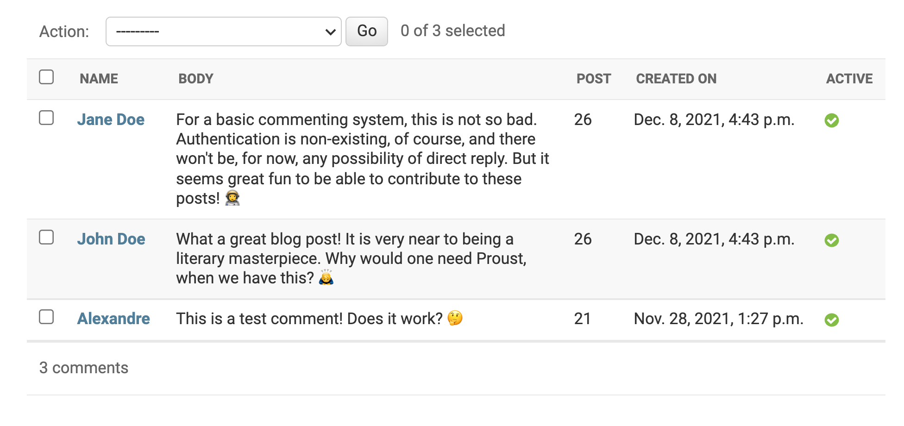

# {{ $page.title }}

The last day had some very promising progress: I got most of the UI for the component down, and finished the day with a good test on API calls. But it is far from done!

## Some fixes on the comment Vue component 🛠

I actually broke the Vue component before finishing the day. The Django form needs information about the post day, which, in the case of this blog, is somewhat manually inputted - that information is on each post's frontmatter. Thus a way to retrieve that information was needed.

Luckily, my friend Sequoya 🌳 reminded me about **props**, and walked me over getting it to work. Props are, per the official documentation, `a list/hash of attributes that are exposed to accept data from the parent component`. In other words, it's information that can be passed down from parent component to a child component. In this case, the Comment component can accept a prop for the page title, as below:

```html
<CommentsStub :title="$frontmatter.title"/>
```

With this, it was a matter of adding a `day` parameter to the already established `form`. 

``` js
day: this.title.split()[1],
```

With this, the Comments component is almost done: all it is is missing is the display of previous commentaries. I suppose that is important as well! **Check the updated component below!**

<CommentsStub4 :title="$frontmatter.title"/>

It is done! 🎉

## Further progress with the Django back-end 🏃‍♂️

After manually feeding the previous comments to the Django back-end, I am ready for further optimisation of the response.



Recall that the API response is still very basic, is badly misformatted, and is missing some very important information:

```
Comment What a great blog post! It is very near to being a literary masterpiece. Why would one need Proust, when we have
this? 🙇‍♂️ by John DoeComment For a basic commenting system, this is not so bad. Authentication is non-existing, of
course, and there won't be, for now, any possibility of direct reply. But it seems great fun to be able to contribute to
these posts! 👩‍🚀 by Jane Doe
```

I need it to include the date, but mostly the content needs *to be easily parsed*. For that, a JSON response is ideal.

This was easily achieved by running my query through the following command:

```python
content = serializers.serialize(
		'json',
		db_content,
		fields=('name, body, created_on'))
```

but this has the following result...

```json
('[{"model": "api.comment", "pk": 2, "fields": {"name": "John Doe", "body": '
 '"What a great blog post! It is very near to being a literary masterpiece. '
 'Why would one need Proust, when we have this? 🙇\u200d♂️", "created_on": '
 '"2021-12-08T16:43:29.378Z"}}, {"model": "api.comment", "pk": 3, "fields": '
 '{"name": "Jane Doe", "body": "For a basic commenting system, this is not so '
 "bad. Authentication is non-existing, of course, and there won't be, for now, "
 'any possibility of direct reply. But it seems great fun to be able to '
 'contribute to these posts! 👩\u200d🚀", "created_on": '
 '"2021-12-08T16:43:52.043Z"}}]')
 ```
 ...which is too verbose for my taste. There is no need to include the underlying content model name, nor its primary key (fun fact: as benign as it might appear to *leak* the private primary keys of the content, that could apparently be used to measure growth in a company! 🤯). In fact, all I need is the `fields` content, and wouldn't mind it being the main content of the JSON response. [Turns out someboby provided a really neat way of creating a serializer for this content!](https://stackoverflow.com/a/70221658)

After adapting the following to my own code, 

```python
def serialize(self):
	return {
		"name": self.name,
		"body": self.body,
		"created_on": self.created_on
	}
```

and running 

```python
content = [comment.serialize() for comment in db_content]
```

the response is much more akin to what my needs are!

```json
[
    {
        "name": "John Doe",
        "body": "What a great blog post! It is very near to being a literary masterpiece. Why would one need Proust, when we have this? 🙇‍♂️",
        "created_on": "2021-12-08T16:43:29.378Z"
    },
    {
        "name": "Jane Doe",
        "body": "For a basic commenting system, this is not so bad. Authentication is non-existing, of course, and there won't be, for now, any possibility of direct reply. But it seems great fun to be able to contribute to these posts! 👩‍🚀",
        "created_on": "2021-12-08T16:43:52.043Z"
    }
]
```
