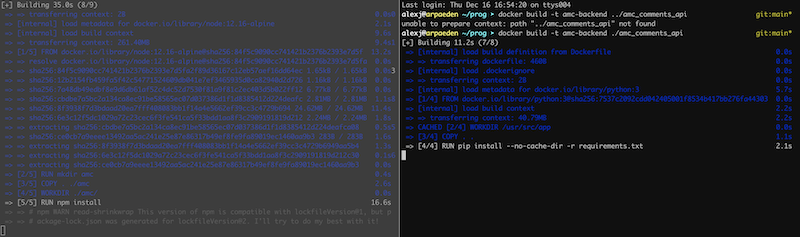

# {{ $page.title }}

## Beginning with some very useful commands 🌈

I managed to get Docker running on the Raspberry, even though I'm still a little unsure on how performative it will be; and so, for a test, I should try and build a very simple service. 

For a start, I'm following [this tutorial at Docker Curriculum](https://docker-curriculum.com/), which seems very good! 

::: tip Docker commands
`docker images` displays the downloaded images for Docker to build <br>
`docker ps` displays all containers that are currently running <br>
`docker container prune` removes stopped containers <br>
<br>
**Flags for** `docker run` <br>
- `-it <container> sh` the -it flags attaches to an interactive tty in the container <br>
- `-d` runs in detached mode (doesn't stop when terminal window closes) <br>
- `-P` exposes the ports <br>
- `--name <something>` assigns the name `something` to a container (one could later do `docker port something` to check the container's open ports)
:::

## Creating a Dockerfile

As the tutorial follows into deploying a Flask app, I'm looking into deploying the comments back-end instead.

```python
FROM python:3

# set a directory for the app
WORKDIR /usr/src/app

# copy all the files to the container
COPY . .

# install dependencies
RUN pip install --no-cache-dir -r requirements.txt

# define the port number the container should expose
EXPOSE 8000

# run the command
CMD ["python", "manage.py", "runserver"]
```

This seems good, but there is no response when launching the image — every browser request to the port is met with a '*The connection was reset*' message. This is due to Django defaulting to `localhost` when ran this way; changing that line to `CMD ["python", "manage.py", "runserver", "0.0.0.0:8000"]` will fix that issue. This is something related to networks that I am not really too comfortable with (yet, hopefully). But it solves the issue!

## Now, onto getting more containers...? 🚀

I feel like I have a decent, very basic grasp on making simple dockerised applications. It is likely that all of my projects can be very painlessly mounted onto Docker containers. How quickly could I have the front-end and back-end of this blog communicating with one another?



Everything seems to go along well, but there is something still not quite right about developing on Docker images. When running the front-end instance without Docker, every change is reactive: if the content changes, the build will automatically reload. This is still not happening with the Docker builds, and it is very unsustainable to be building everything all over again just for a small tweak. But that is...for future Alexandre to handle! 🥳
